###LATIHAN 2
Pada Latihan ini mencoba melakukan pada tutorial yang telah disediakan.
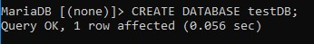
Contoh syntax diatas untuk membuat database dengan nama testDB.
---
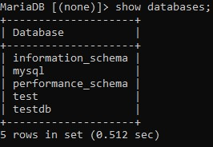
Contoh syntax diatas untuk menampilkan database.
---
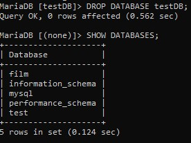
Contoh syntax diatas untuk menghapus database testDB.
---
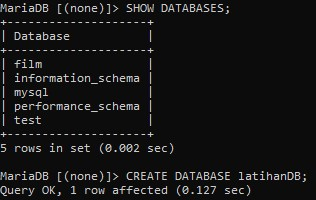
Contoh syntax diatas untuk melihat database apakah testDB masih ada atau tidak.
---
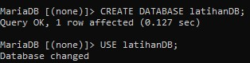
Contoh syntax diatas untuk membuat database baru dengan nama latihanDB
---
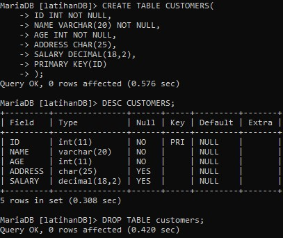
Contoh syntax diatas untuk membuat table customers, menampilkan deskripsi table dan menghapus table.
---
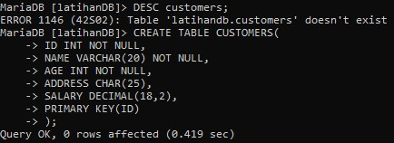
Contoh syntax diatas untuk membuat ulang table customers.
---
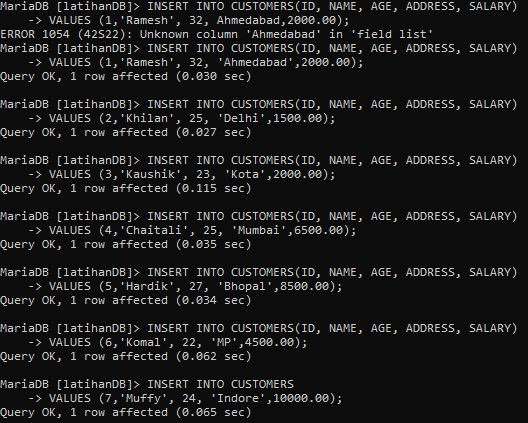
Contoh syntax diatas untuk menginputkan data pada table customers
---
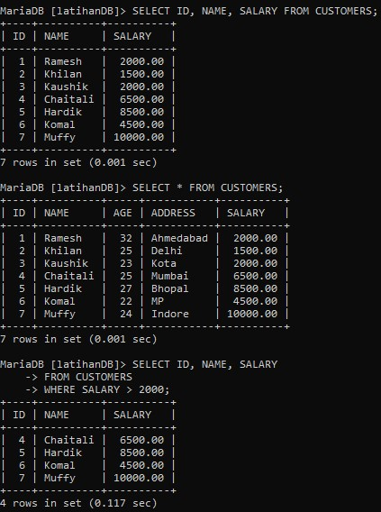
Contoh syntax diatas untuk memilih apa saja yang akan ditampilkan.
---
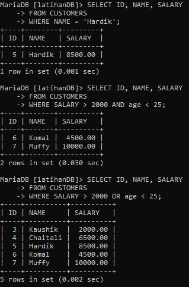
Contoh syntax diatas untuk memilih apa saja yang akan ditampilkan dengan perintah AND dan OR.
---
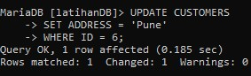

---
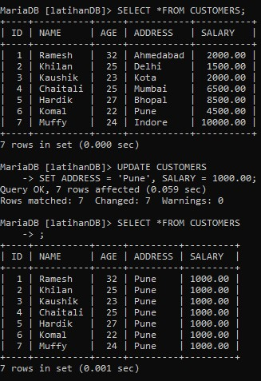

---
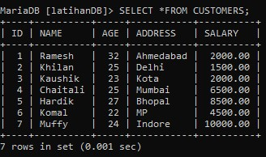

---
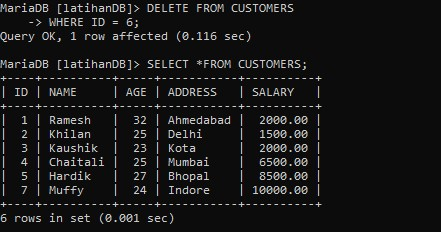

---
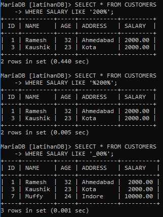

---
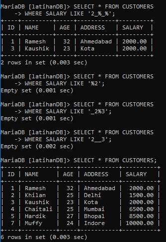

---
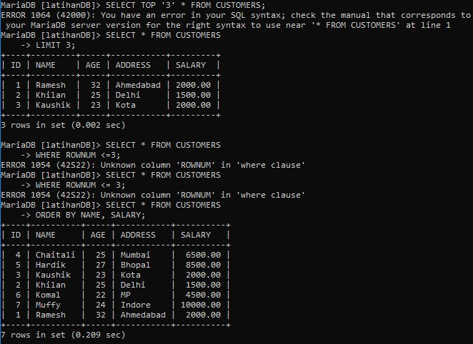

---
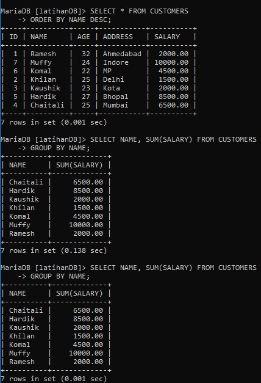

---
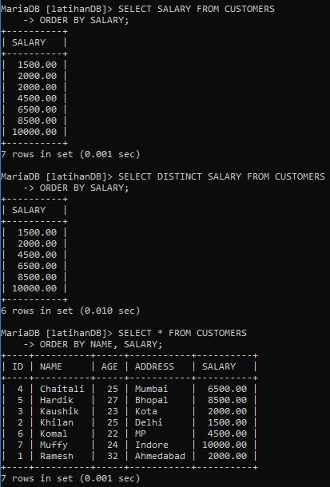

---
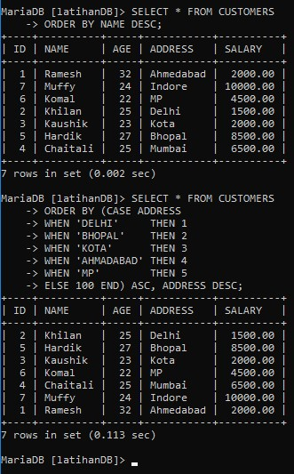

---