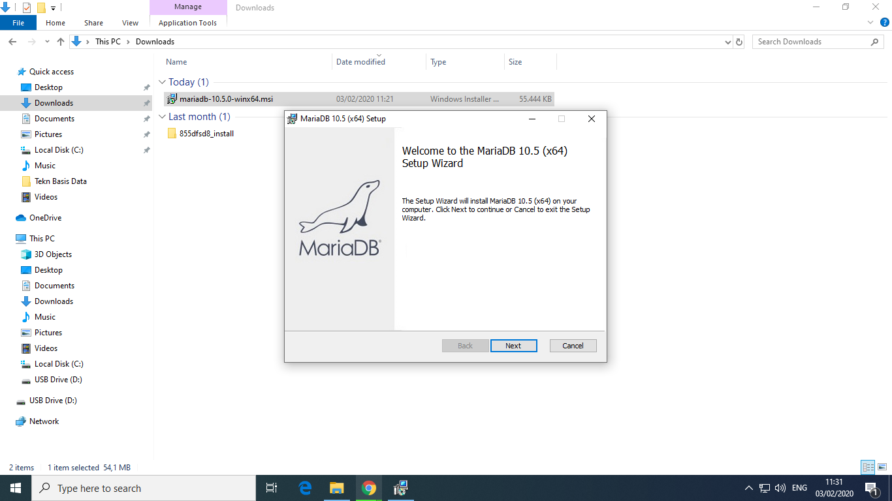
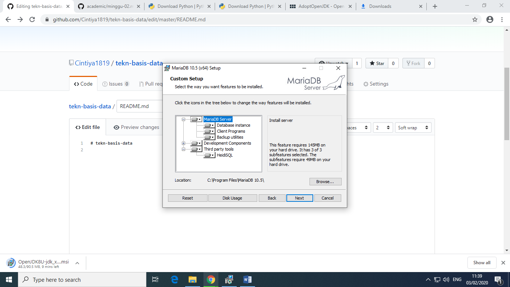
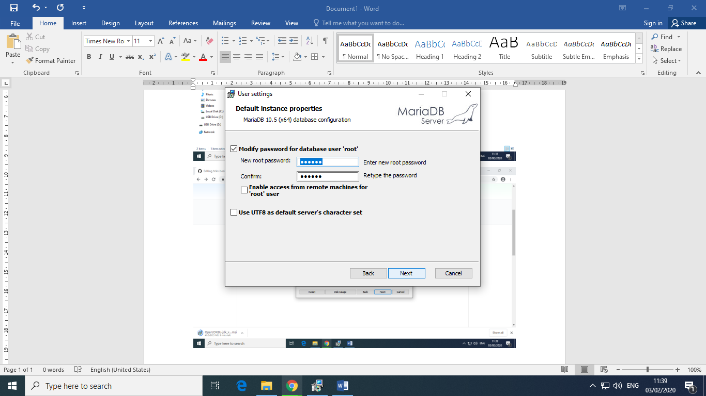
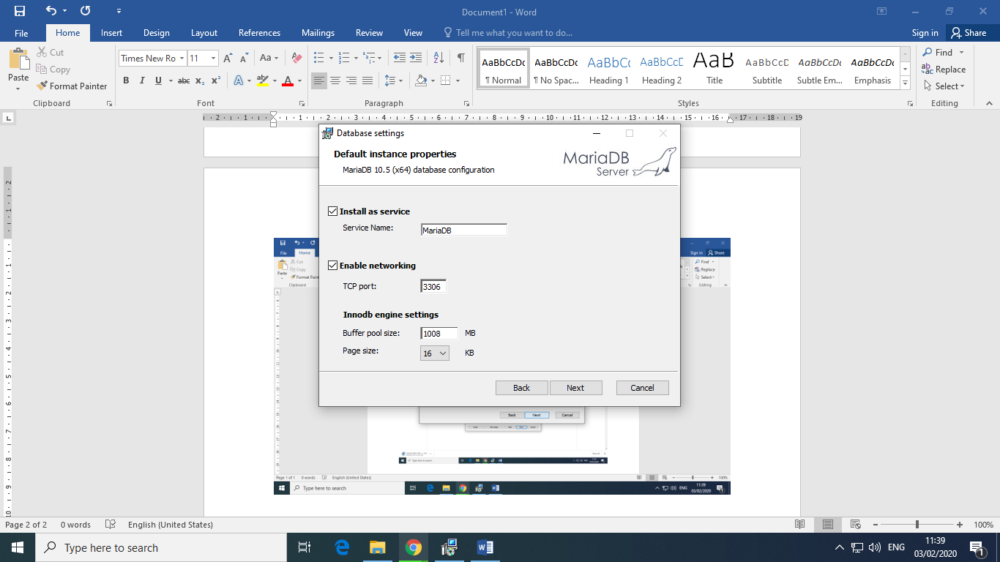
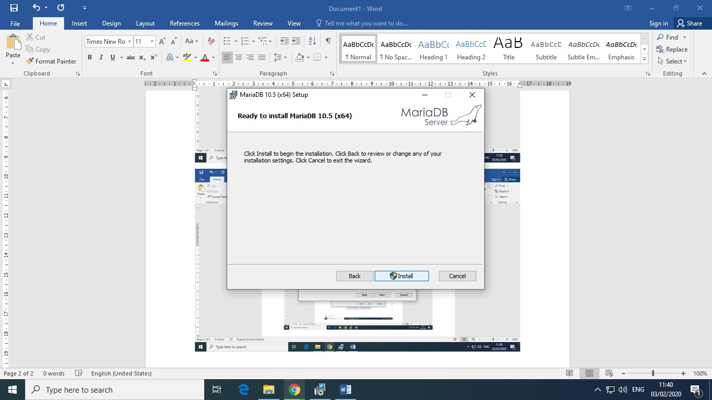
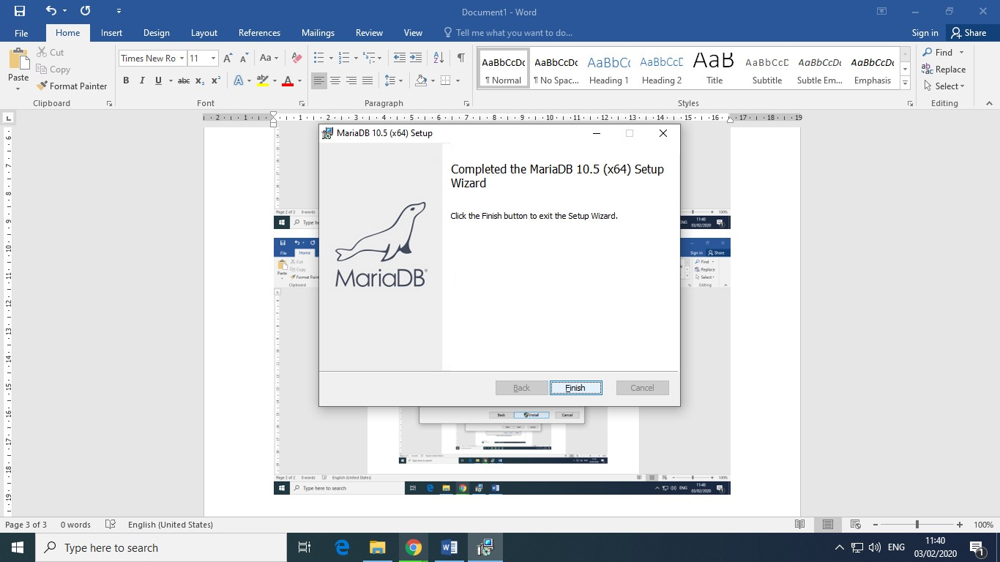

#LAPORAN PRAKTIKUM TEKNOLOGI BASIS DATA PERTEMUAN 1
---
###LATIHAN 1

Pada latihan 1 ini menginstall MariaDB, terlebih dahulu siapkan software MariaDB untuk diInstall, lalu buka MariaDB, dan klik Next terus sampai pada bagian User Settings, pada user settings tersebut masukan password yang dikehendaki. Lalu klik next dan install, tunggu beberapa menit. Lalu finish.
---
LISTING LATIHAN 1
      
---
