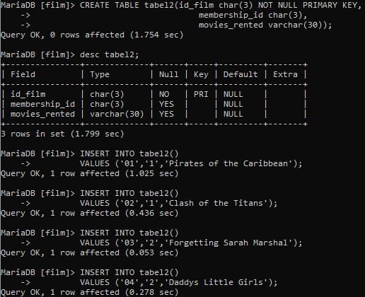

# TUGAS

-----

Contoh syntax diatas untuk membuat database bernama film
---

Contoh syntax diatas untukmenampilkan database, dan mengubah none menjadi film. Lalu membuat table dengan nama tabel1.
---

Contoh syntax diatas untuk menginputkan data pada table 1.
---

Contoh syntax diatas untuk menampilkan tabel1.
---

Contoh syntax diatas untuk membuat tabel2 dan menginputkan data pada tabel tersebut.
---

Contoh syntax diatas untuk menampilkan tabel2.
---

### Query

Query tersebut untuk memilih menampilkan full_names dan movies dari tabel2, menghubungkan antara membership_id pada tabel 1 dan tabel 2, dimana full_names = Janet Jones.
