# LATIHAN

### Pada Latihan ini mencoba melakukan pada tutorial yang telah disediakan.
---

### Latihan 1

Install MongoDB seperti halnya aplikasi biasa, dan secara default akan tersimpan di C:\Program Files\MongoDb. Kita bisa mengubah lokasi installnya dengan memilih custom pada saat instalasi. Asumsi MongoDB terinstall di C:\mongodb, dan binary nya berada di folder C:\mongodb\bin.

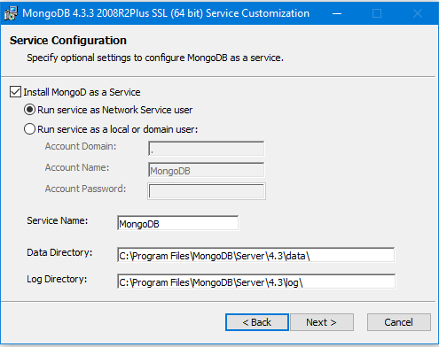

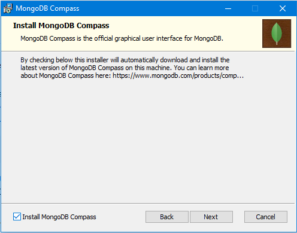

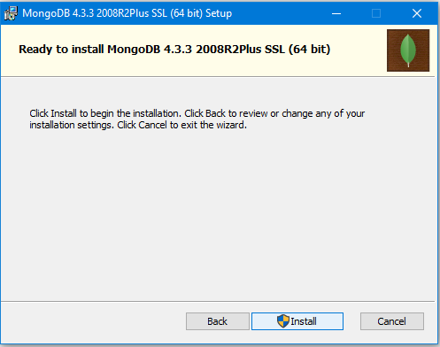

---

### Latihan 2

Menjalankan mongoDB server dengan mongo shell.

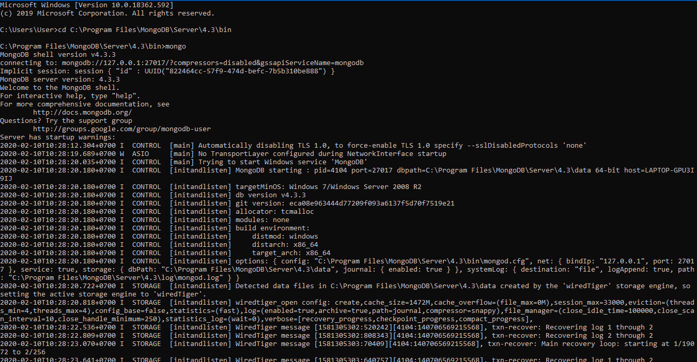

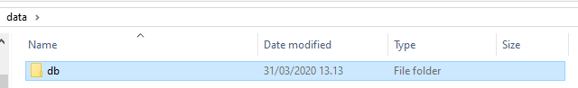

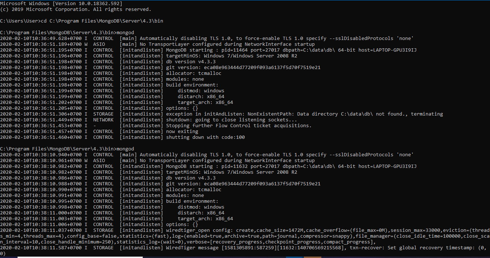

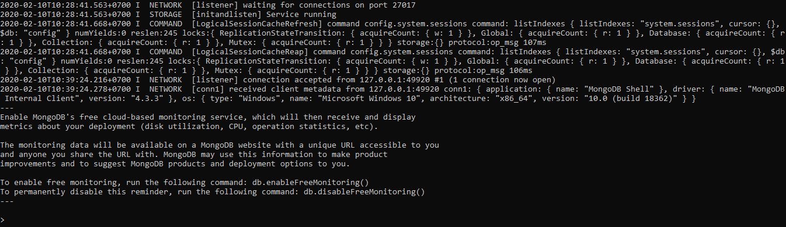

---

### Latihan 3

Mengerjakan [Getting Started](https://docs.mongodb.com/manual/tutorial/getting-started/) dari 0 sampai 4.

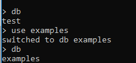

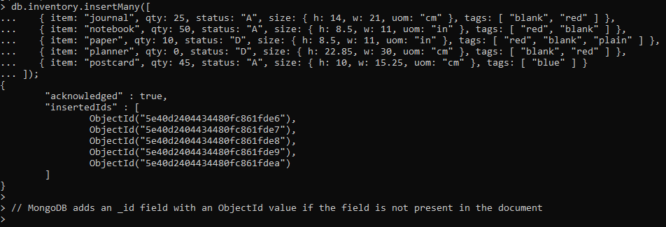

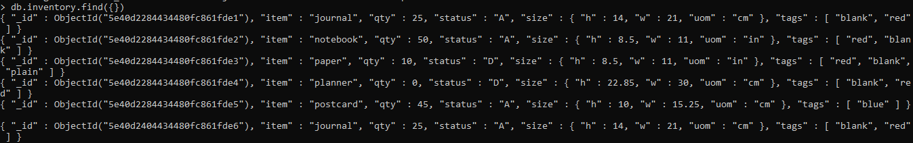

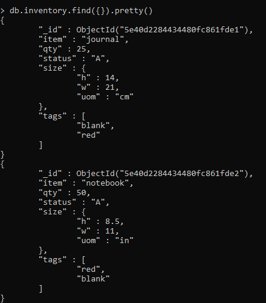

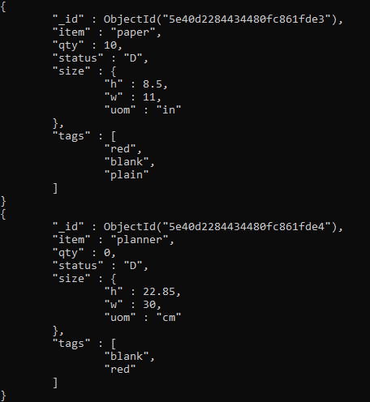

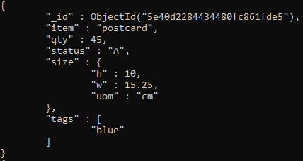

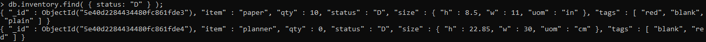

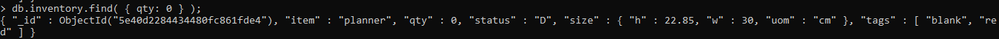

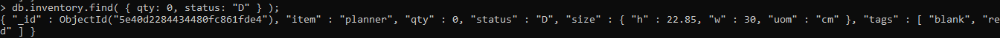

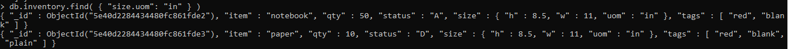

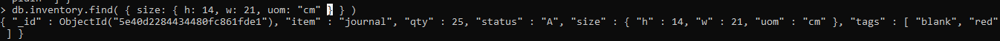

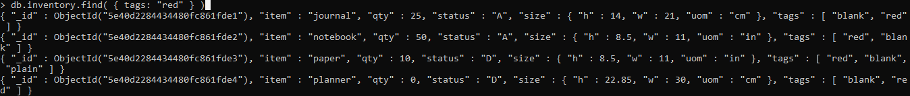

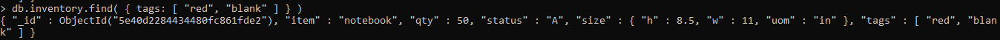

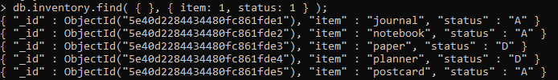

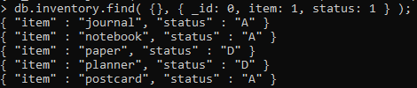

---

### Latihan 4

Mengerjakan [CRUD](https://docs.mongodb.com/manual/crud/)

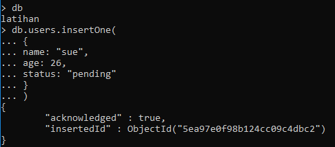

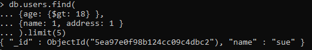

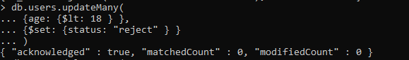

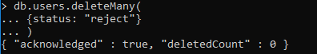