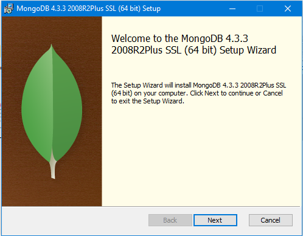
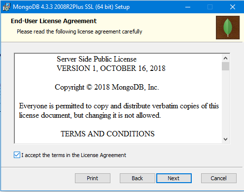
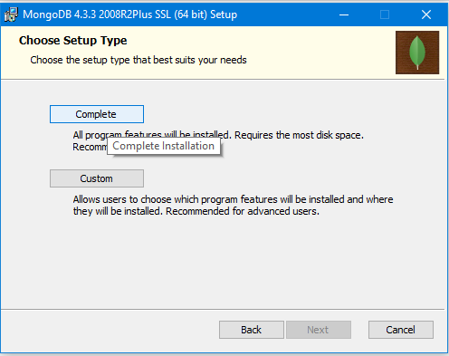

# LATIHAN

### Pada Latihan ini mencoba melakukan pada tutorial yang telah disediakan.

Install MongoDB seperti halnya aplikasi biasa, dan secara default akan tersimpan di C:\Program Files\MongoDb. Kita bisa mengubah lokasi installnya dengan memilih custom pada saat instalasi. Asumsi MongoDB terinstall di C:\mongodb, dan binary nya berada di folder C:\mongodb\bin.

     
---

Contoh syntax diatas untuk membuat ulang table customers.
---

Contoh syntax diatas untuk menginputkan data pada table customers
---

Contoh syntax diatas untuk memilih apa saja yang akan ditampilkan.
---

Contoh syntax diatas untuk memilih apa saja yang akan ditampilkan dengan perintah AND dan OR.
---

Contoh syntax diatas untuk mengubah data pada table customers.
---

Contoh syntax diatas untuk mengubah semua data pada address dan salary di table customers.
---

---

Contoh syntax diatas untuk menghapus data pada id 6.
---

---

Contoh syntax diatas untuk memilih untuk menampilkan dengan perintah like.
---

Contoh syntax diatas untuk memilih menampilkan data berdasarkan urutan yang dikehendaki
---

Contoh syntax diatas untuk memilih menampilkan nama dan jumlah gaji pada table customers dengan mengurutkan berdasarkan nama.
---

---

---