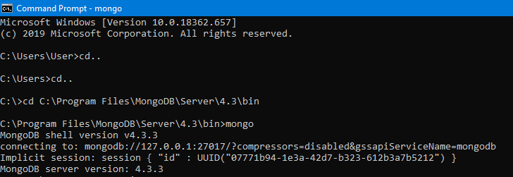
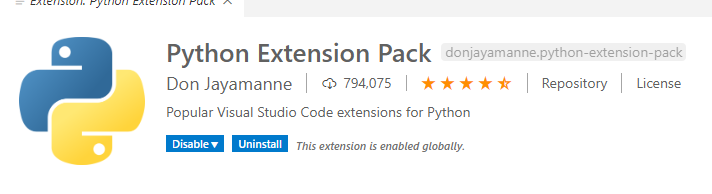
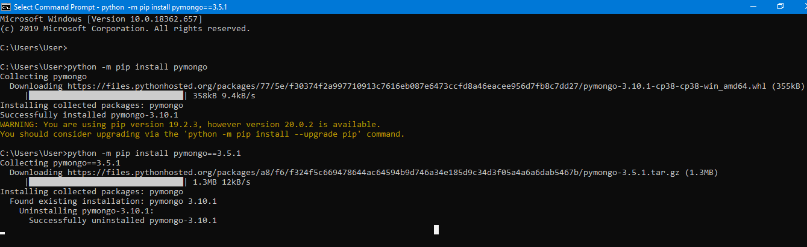
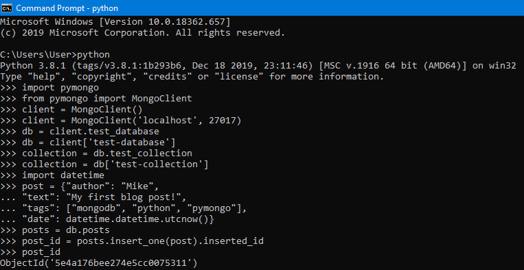
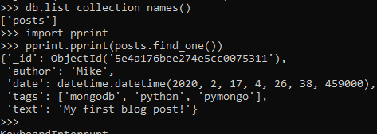
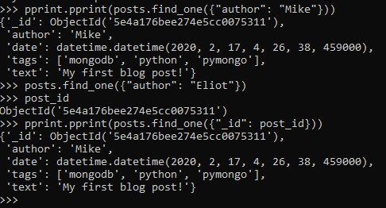

# LATIHAN

### Pada Latihan ini mencoba melakukan pada tutorial yang telah disediakan.
---

### Latihan 1

Mengaktifkan MongoDB server

---

### Latihan 2

Install Python

Saya sudah menginstall python sebelumnya

---

### Latihan 3

Menginstall VS Code serta extension untuk Python

Saya sudah menginstall VS Code sebelumnya, jadi hanya menginstall Extension untuk Python saja

---

### Latihan 4

Mengerjakan Instalasi PyMongo

### Latihan 5

Mengerjakan [tutorial](https://api.mongodb.com/python/current/tutorial.html) menggunakan PyMongo

