# LATIHAN

### Pada Latihan ini mencoba melakukan pada tutorial yang telah disediakan.
---

### Latihan 1

Menjalankan redis server dengan sistem operasi linux

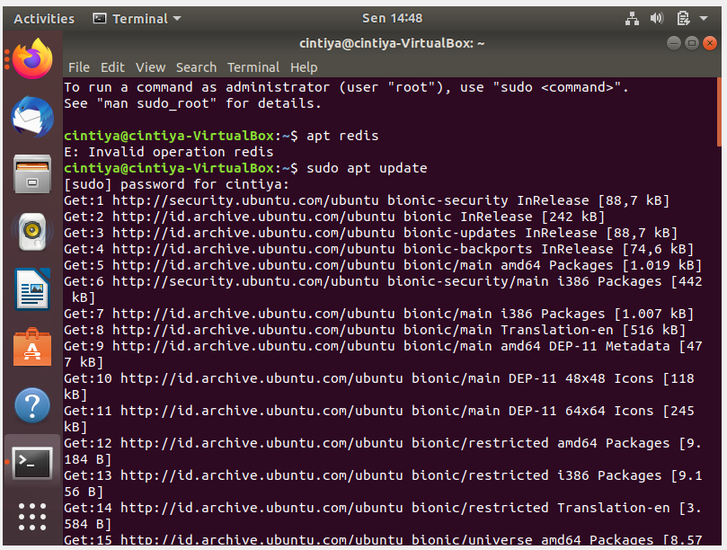

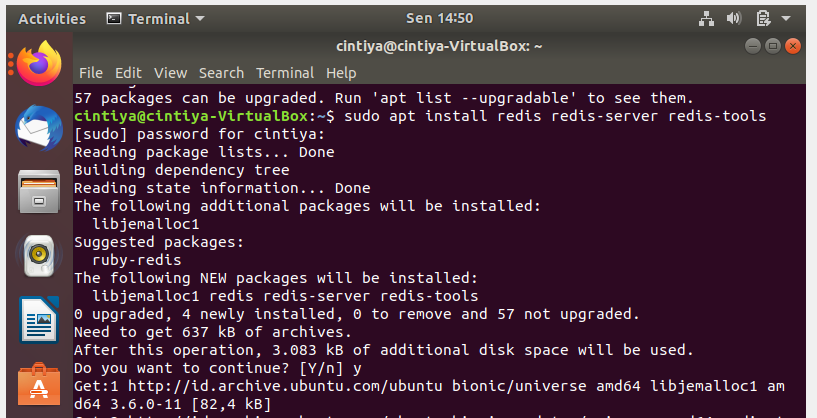

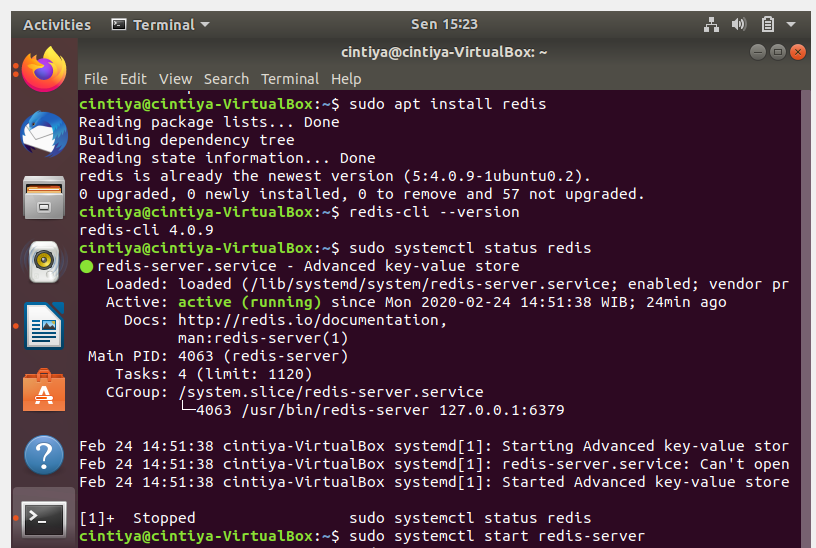

---

### Latihan 2

Menkoneksikan redis-cli ke server redis menggunakan Docker.

    Karena saya menggunakan sistem operasi linux, maka tidak perlu menkoneksikan.

---

### Latihan 3

Mengerjakan [Cheatsheet Redis Basic Command](https://gist.github.com/LeCoupa/1596b8f359ad8812c7271b5322c30946) bagian cli command dan data types

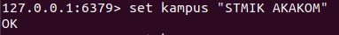

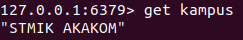

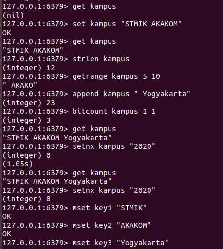

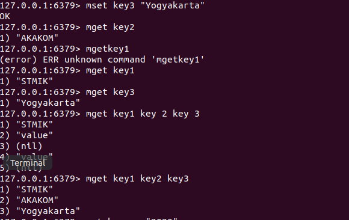

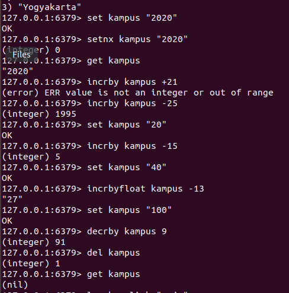

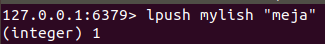

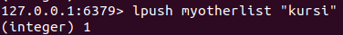

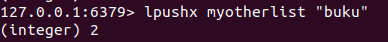

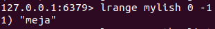

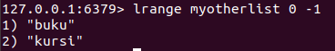

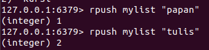

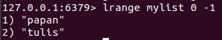

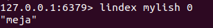

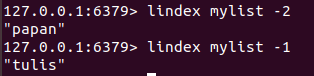

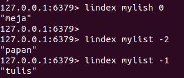

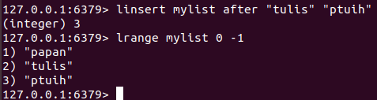

