# LATIHAN

### Pada Latihan ini mencoba melakukan pada tutorial yang telah disediakan.
---

### Latihan 1

Menginstall python untuk redis

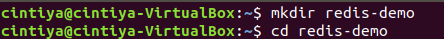

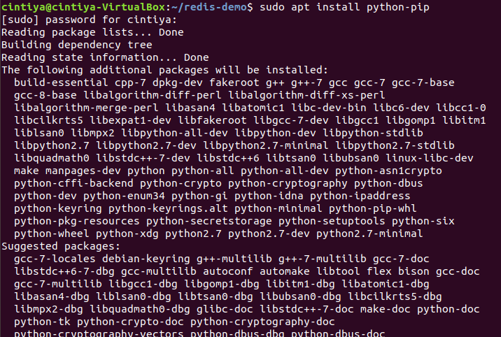

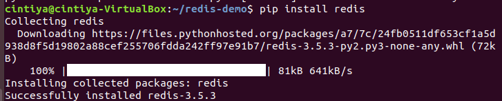

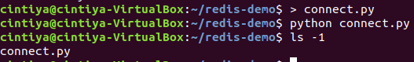

---

### Latihan 2

Mengerjakan materi [Getting started with redis-py](https://www.agiliq.com/blog/2015/03/getting-started-with-redis-py/), [Using Redis In-memory Storage for your Python Applications](https://hackersandslackers.com/redis-py-python/) dan [Build Your First Redis Hello World Application in Python](https://opensource.com/article/18/4/how-build-hello-redis-with-python)

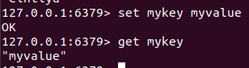

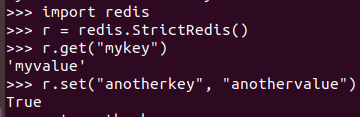

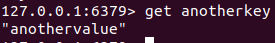

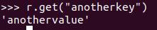

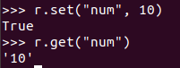

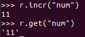

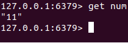

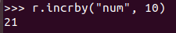

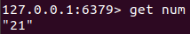

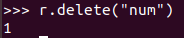

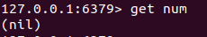
