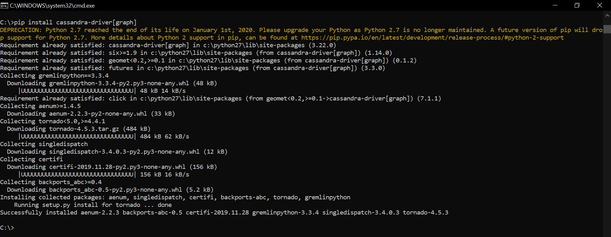
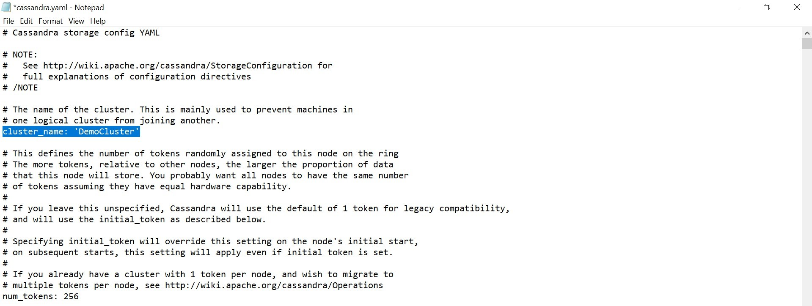
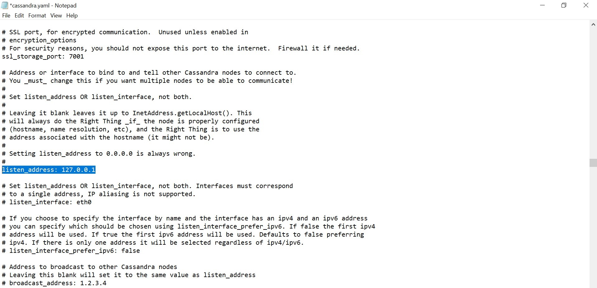

# LATIHAN

---

### Latihan 1

Menginstall driver Apache Cassandra untuk Python

---

### Latihan 2

Mengerjakan [Getting Started](https://docs.datastax.com/en/developer/python-driver/3.21/getting_started/)

