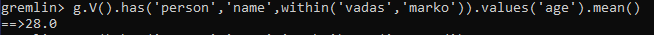

# LATIHAN

### Pada Latihan ini mencoba melakukan pada tutorial yang telah disediakan.

### Latihan 1
---

Siapkan file apache tinkerpop gremlin console, jika belum ada maka unduh arsip file [Gremlin](https://tinkerpop.apache.org/) lalu ekstrak.

Masuk ke commond prompt, lalu pindah ke direktori C:\Program Files\Java\jdk1.8.0_111\bin lalu enter, untuk menampilkan versijava maka menggunakan kode **java -version**

Masuk ke commond prompt baru, lalu pindah ke direktori apache-tinkerpop-gremlin-console-3.4.6\bin.

Untuk melihat isi dari direktori tersebut.

### Latihan 2
---

Untuk masuk ke gremlin menggunakan gremlin.bat

Perintah pertama membuat Graphinstance bernama graph, yang dengan demikian menyediakan referensi ke data yang ingin dilalui GREMLIN. Sayangnya, hanya memiliki graphtidak memberikan GREMLIN konteks yang cukup untuk melakukan pekerjaannya. Anda juga memerlukan sesuatu yang disebut TraversalSource, yang dihasilkan oleh perintah kedua. The TraversalSource memberikan informasi tambahan kepada GREMLIN (seperti strategi traversal untuk diterapkan dan mesin traversal untuk digunakan) yang memberinya panduan tentang bagaimana menjalankan perjalanannya di sekitar Graph.

Ada beberapa cara untuk membuat TraversalSource. Contoh di atas menggunakan gaya tertanam dan merupakan pendekatan terbatas untuk bahasa menggunakan Java Virtual Machine (JVM). Metode lain serupa dalam bentuk, tetapi bukan fokus tutorial ini. Lihat Dokumentasi Referensi untuk informasi lebih lanjut tentang berbagai cara menghubungkan dengan GREMLIN .

1. Dapatkan semua simpul di Graph.
2. Dapatkan simpul dengan pengidentifikasi unik "1".

3. Dapatkan nilai nameproperti pada titik dengan pengidentifikasi unik "1".

4. Dapatkan tepi dengan label "tahu" untuk titik dengan pengidentifikasi unik "1".
5. Dapatkan nama-nama orang yang memiliki simpul dengan pengidentifikasi unik "1" "tahu".
6. Perhatikan bahwa ketika seseorang menggunakan outE().inV()seperti yang ditunjukkan pada perintah sebelumnya, ini dapat disingkat menjadi adil out() (mirip dengan inE().outV()dan in()untuk tepi yang masuk).
7. Dapatkan nama orang-orang vertex "1" tahu siapa yang berusia di atas 30.

Simpul, tepi, dan properti merupakan elemen terpenting dari keberadaannya. Memang sangat membantu untuk memikirkan teman kita, GREMLIN, bergerak di sekitar grafik ketika mengembangkan traversal, seperti menggambarkan posisinya ketika traverser membantu mengarahkan ke mana Anda membutuhkannya untuk pergi selanjutnya. Mari kita gunakan grafik dua sudut, satu sisi yang telah kita bahas di atas sebagai contoh. Pertama, Anda perlu membuat grafik diatas

Operasi ini adalah langkah penyaringan karena mencari set lengkap simpul untuk mencocokkan dengan yang memiliki nilai properti "nama" dari "marko". Ini dapat dilakukan dengan langkah has () seperti diatas.

Bit GREMLIN ini dapat ditingkatkan dan dibuat lebih menyenangkan secara idiomatis dengan memasukkan label titik sebagai bagian dari filter untuk memastikan bahwa kunci properti "nama" mengacu pada titik "orang".

GREMLIN telah menemukan "marko", dia dapat mempertimbangkan langkah berikutnya dalam traversal di mana kita memintanya untuk "berjalan" di sepanjang "menciptakan" tepi ke simpul "perangkat lunak". Seperti yang dijelaskan sebelumnya, ujung memiliki arah, jadi kami harus memberi tahu GREMLIN arah mana yang harus diikuti. Dalam hal ini, kami ingin dia menelusuri tepi keluar dari titik "marko". Untuk ini, kami menggunakan langkah outE .

Untuk sampai ke titik di ujung yang lain dari tepi, Anda harus memberi tahu GREMLIN untuk bergerak dari tepi ke titik yang masuk inV().

Karena Anda tidak meminta GREMLIN untuk melakukan apa pun dengan properti dari tepi "dibuat"

Sekarang GREMLIN telah mencapai "perangkat lunak yang dibuat Marko", ia memiliki akses ke properti dari vertex "perangkat lunak" dan oleh karena itu Anda dapat meminta GREMLIN untuk mengekstraksi nilai properti "nama" seperti diatas

Meminta GREMLIN untuk melakukan beberapa tugas traversal yang lebih sulit. Tidak banyak lagi yang dapat dilakukan dengan grafik "bayi" yang kami miliki, jadi mari kita kembali ke grafik mainan "modern" dari bagian "Lima Menit Pertama". Ingatlah bahwa Anda dapat membuat ini Graphdan membangun TraversalSource

Sebelumnya telah menggunakan has()-step untuk memberi tahu GREMLIN bagaimana menemukan titik "marko". Mari kita lihat beberapa cara lain untuk digunakan has(). Bagaimana jika kita ingin GREMLIN menemukan nilai "usia" dari "vadas" dan "marko"? Dalam hal ini kita dapat menggunakan withinkomparator dengan has() seperti diatas

Jika kita ingin bertanya kepada GREMLIN usia rata-rata "vadas" dan "marko" kita bisa menggunakan langkah mean ()

Metode penyaringan lainnya terlihat dalam penggunaan langkah di mana . Kami tahu cara menemukan "perangkat lunak" yang "marko" seperti diatas

Pertama-tama kita harus memotret GREMLIN di mana kita meninggalkannya dalam permintaan sebelumnya. Dia berdiri di puncak "perangkat lunak". Untuk mencari tahu siapa yang "menciptakan" "perangkat lunak" itu, kita harus memiliki GREMLIN melintasi kembali di sepanjang tepi "dibuat" untuk menemukan "orang" simpul terikat padanya.

kita dapat melihat bahwa "peter", "josh" dan "marko" semua bertanggung jawab untuk membuat "v [3]", yang merupakan "perangkat lunak" simpul bernama "lop". Tentu saja, kita sudah tahu tentang keterlibatan "marko" dan rasanya aneh untuk mengatakan bahwa "marko" berkolaborasi dengan dirinya sendiri, jadi mengecualikan "marko" dari hasil tampaknya logis. Traversal berikut menangani pengecualian seperti diatas:

Membuat dua tambahan pada traversal untuk membuatnya mengecualikan "marko" dari hasil. Pertama, kami menambahkan as () . Langkah as()-tidak benar-benar "langkah", tetapi "modulator langkah" - sesuatu yang menambahkan fitur ke langkah atau traversal. Di sini, as('exclude')label has()-langkah dengan nama "kecualikan" dan semua nilai yang melewati langkah itu disimpan dalam label itu untuk digunakan nanti. Dalam hal ini, simpul "marko" adalah satu-satunya simpul yang melewati titik itu, sehingga disimpan dalam "kecualikan".

Tambahan lain yang dibuat adalah where()-step, yang merupakan langkah filter seperti has(). The where()diposisikan setelah in()-Langkah yang memiliki "orang" simpul, yang berarti bahwa where()filter terjadi pada daftar "marko" kolaborator. The where()menetapkan bahwa "orang" simpul melewati seharusnya tidak sama (yaitu, neq()) isi dari "mengecualikan" label. Karena hanya berisi simpul "marko", thewhere() filter keluar "marko" yang kita dapatkan ketika kita melintasi kembali di atas "diciptakan" tepi.

Anda akan menemukan banyak kegunaan as().

 Langkah umum namun penting lainnya adalah grup () langkah dan modulator langkah terkait yang disebut oleh () . Jika kami ingin meminta GREMLIN untuk mengelompokkan semua simpul dalam grafik dengan label simpul mereka

Penggunaan di by()sini menyediakan mekanisme untuk melakukan pengelompokan. Dalam hal ini, kami telah meminta GREMLIN untuk menggunakan label(yang, sekali lagi, merupakan impor statis otomatis dari Tkonsol). Kami tidak dapat benar-benar memberi tahu banyak tentang distribusi kami karena kami hanya memiliki pengidentifikasi simpul yang unik sebagai output. Untuk membuatnya lebih bagus, kita bisa meminta GREMLIN untuk memberi kita nilai properti "nama" dari simpul tersebut, dengan memasok by() modulator lain group()untuk mengubah nilai.
