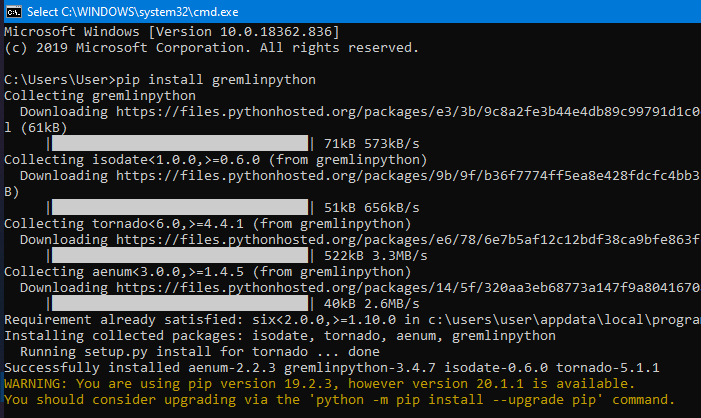
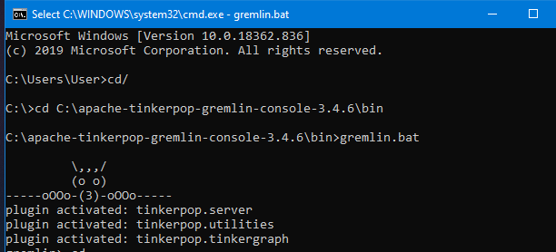
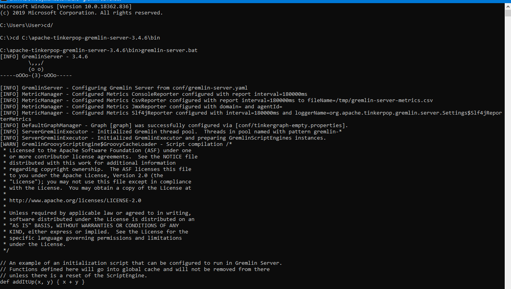
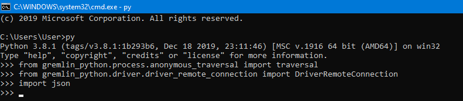
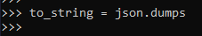
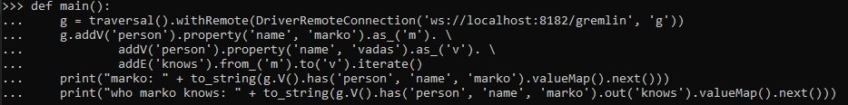
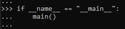

# LATIHAN
---

### Pada Latihan ini mencoba melakukan pada tutorial yang telah disediakan.

---
### Latihan 1
---

Siapkan file apache tinkerpop gremlin server, jika belum ada maka unduh arsip file [Gremlin](https://tinkerpop.apache.org/) pilih yang sever. Jika sudah di unduh lalu ekstrak.

Masuk ke commond prompt, lalu instal python gremlin menggunakan pip

Masuk ke commond prompt baru, lalu pindah ke direktori apache-tinkerpop-gremlin-console-3.4.6\bin. Lalu masuk menggunakan gremlin.bat

Masuk ke commond prompt baru, lalu pindah ke direktori apache-tinkerpop-gremlin-server-3.4.6\bin. Lalu masuk menggunakan gremlin-server.bat

---
### Latihan 2
---

Masuk ke python dengan menggunakan commond prompt dengan mengetikkan py

Mengimport traversal dari gremlin.python.process.anonymous_traversal, selanjutnya mengimport DriverRemoteConnection dari fremlin_python.driver.driver_remote_connection dan yang terakhir mengimport json.

Menggunakan metode to_string untuk masuk ke json.dumps

