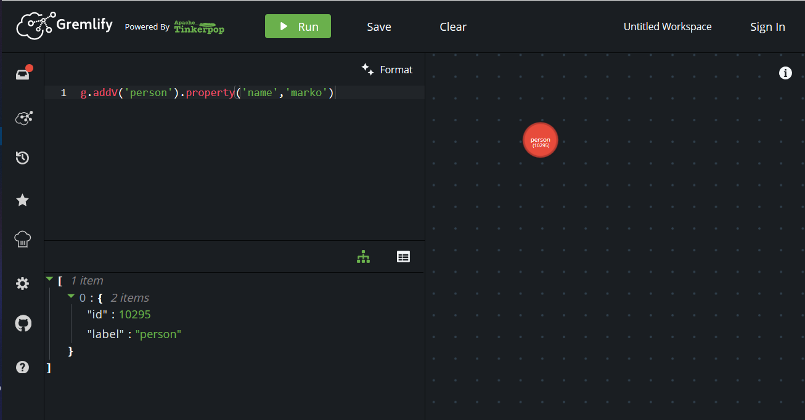
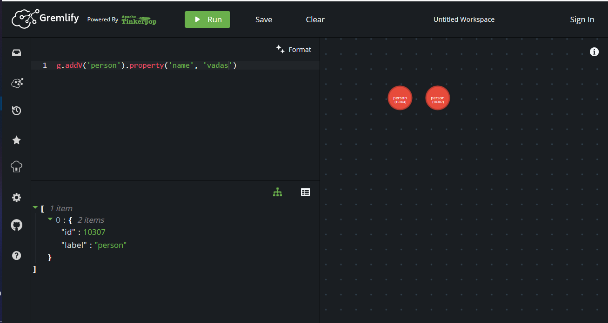

# TUGAS

### Dari latihan no 2, gambarlah dalam bentuk graph menggunakan

---

Masuk ke [gremlify](https://gremlify.com/) untuk mengerjakan tugas.

1. Menggambar grafik dengan nama Marko

Ketika di run, maka akan muncul 1item yaitu urutan 0 dengan id : 10295 dan label : person

2. Menggambar grafik dengan nama Vadas

Ketika di run, maka akan muncul 1item yaitu urutan 0 dengan id : 10307 dan label : person. Grafik vados bersebelahan dengan grafik marko.