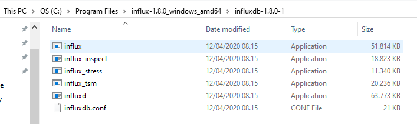

# LATIHAN

### Pada Latihan ini mencoba melakukan pada tutorial yang telah disediakan.

### Latihan 1
---
Siapkan file influxDB, jika belum ada maka unduh arsip file [InfluxDB](https://portal.influxdata.com/downloads/)

Jika sudah menyiapkan file, maka ekstrak file tersebut dan copy C:\Program Files\influx-1.8.0_windows_amd64\influxdb-1.8.0-1.

![Gambar 2] (L1.png)
Buka Commond Prompt, dengan cara tekan tombol windows + r pada keyboard, Lalu ketik cmd, enter. Pindah direktori ke direktori influxDB dengan paste alamat direktori. lalu ketik influxd.exe untuk membuka server influxDB.

![Gambar 3] (L2.png)
Buka Commond Prompt baru, lalu lakukan hal yang sama seperti penjelasan sebelumnya, lalu ketik inlux.exe untuk mengkoneksikan ke influxDB.

### Latihan 2
---
![Gambar 4] (L3.png)
Untuk membuat suatu database baru menggunakan sintak **CREATE DATABASE (nama_database)** dengan nama mydb, dan untuk melihat seluruh database menggunakan **SHOW DATABASES**, dan fungsi dari **USE (nama_database)** adalah untuk mengatur dan memilih database yang diinginkan

![Gambar 5] (L4.png)
Untuk membuat tabel baru dan mengisi sebuah record dan data pada record pada database menggunakan perintah **INSERT (nama_tabel),record1=data_record1,record2=data_record2, dst**
Untuk menampilkan tabel dan isinya menggunakan perintah **SELECT "record1", "record2", FROM "nama_tabel)**
Maka outputnya akan menampilkan isi tabel.

![Gambar 6] (L5.png)
Menambahkan tabel dengan nama temperature, record dan data baru. Dan menampilkan seluruh isi tabel temperature.

![Gambar 7] (L6.png)
Sintak ini untuk menampilkan seluruh isi dari database mydb.

![Gambar 8] (L7.png)
Pada perintah select yang pertama unuk menampilkan tabel cpu_load_short. Dan yang kedua menampilkan tabel cpu_load_short dimana nilai > 0.9. Permasalahan disini adalah tidak ada tabel yang bernama cpu_load_short