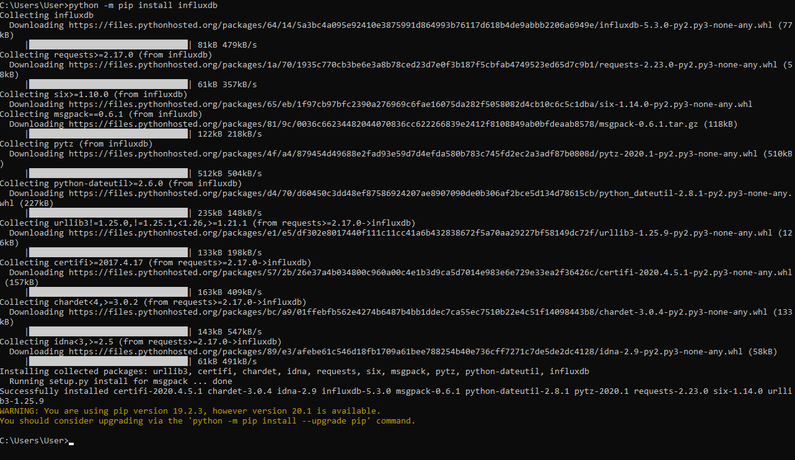
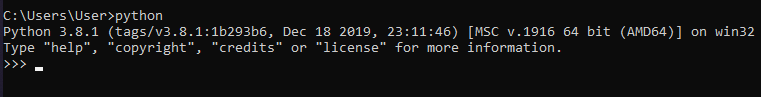
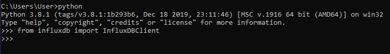
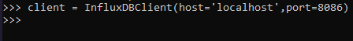
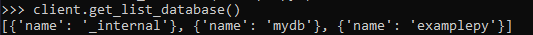
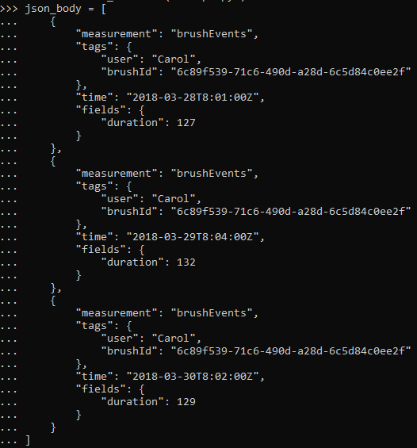
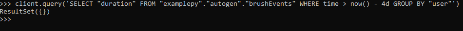
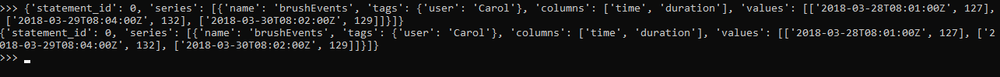

# LATIHAN

### Pada Latihan ini mencoba melakukan pada tutorial yang telah disediakan.

### Latihan 1
---

Install python untuk influxdb menggunakan commond prompt, ketik sintak untuk mendownload python influxdb seperti diatas, lalu enter. Tunggu sampe selesai meng unduh.

Buka Commond Prompt baru, lalu ketik python untuk membuka python.

Untuk mengimport influxDBClient dari influxdb ke python

Membuat portal baru dengan nama client dari influxDBClient, dengan memasukan host dan port.

Membuat database baru dengan nama examplepy

Menampilkan seluruh database yang tersedia.

Memilih database 'examplepy'

Untuk memasukan data pada tabel yang bernama json_body

Untuk menampilkan argumen dari tabel json_body menggunakan metode write_points.

Untuk meminta kembali data-data pada database

Untuk meminta semua pengukuran dalam database , dikelompokkan berdasarkan pengguna.